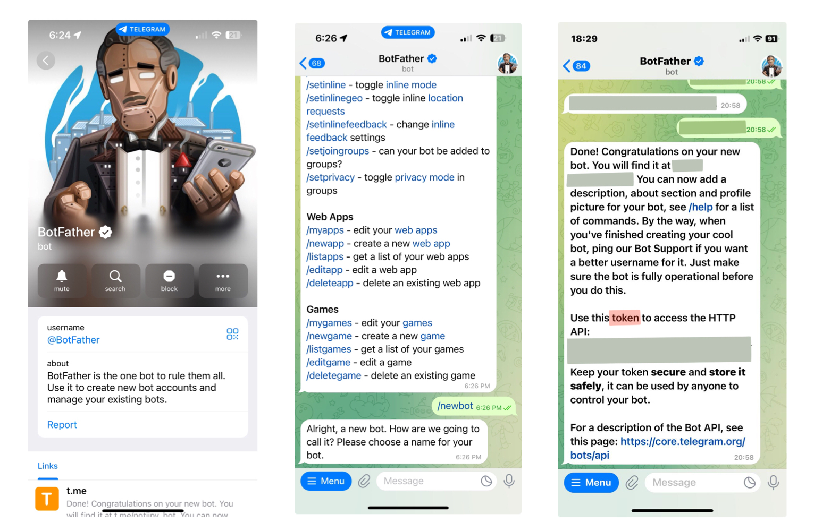
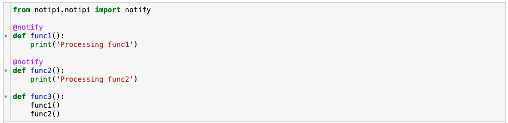

 

<p align="center">
  
</p>

## Introduction

`notipi` is a python library to send custom notifications on Telegram and MacOS<br>

Use cases include:
- Getting notified whenever a long running scripts finishes execution
- Knowing whenever a milestone is reached during ML / DL trainings

## Installation
    $ pip install notipi 

## Setup
If you wish to use just the MacOS notifications and not Telegram - you don't need anymore steps and start using the library right away. Refer the Usage examples below.

To use Telegram - you would be needing two environment variables: `BOT_API_TOKEN` and `CHAT_ID`

<u>To get `BOT_API_TOKEN`:</u>

- In the telegram app, initiate conversation with `@BotFather` (you can also click [here](https://t.me/BotFather)).
- Send `/newbot` as the message to `@BotFather` and provide a new name and username for your bot account as per the instructions.
- `@BotFather` will reply with a unique api token - this is your `BOT_API_TOKEN` <br>
(Note: Detailed instructions to create a new bot can be found at [Telegram website](https://core.telegram.org/bots/features#creating-a-new-bot:~:text=and%20managing%20bots.-,Creating%20a%20new%20bot,-Use%20the%20/newbot))

<p align="center">
  
</p>

<u>To get `CHAT_ID`:</u>
- Once a new bot is created, send a dummy message to the bot via Telegram app so that your chat gets assigned an ID. <br>
- Run the following script with your `BOT_API_TOKEN` to get your `CHAT_ID`
```python
from notipi.notipi import get_chat_id
get_chat_id(BOT_API_TOKEN)
```

This will give the following output:
```
Your CHAT ID: 1234567890
```

Once the `BOT_API_TOKEN` and `CHAT_ID` are obtained, set the environment variables

    export BOT_API_TOKEN=<bot_api_token>
    export CHAT_ID=<chat_id>

## Usage

Once the required environment variables are in place, you can use `notipi` in the following ways to send messages via Telegram. <br>
(**NOTE**: If the environment variables are not set - the messages will be sent only via MacOS notifications by default)

### (1) As a regular function

```python
from notipi.notipi import notify

def func():
    for i in range(1000):
        if i%100==0:
            notify(f"Currently at {i}")
```

### (2) As a decorator
```python
from notipi.notipi import notify

@notify
def func():
    for i in range(1000):
        pass
```

When `func()` is invoked - you will be notified once it finishes execution

`NOTE`: Both Approaches (1) and (2) are compatible inside Jupyter Notebook as well

<p align="left">
  
</p>

Once `func3()` is invoked - you will receive two notifications - first one after `func1()` is processed and second one after `func2()` is executed.

### (3) As a command line tool
    $ noticli -c python example.py
A notification will be sent once `example.py` finishes execution